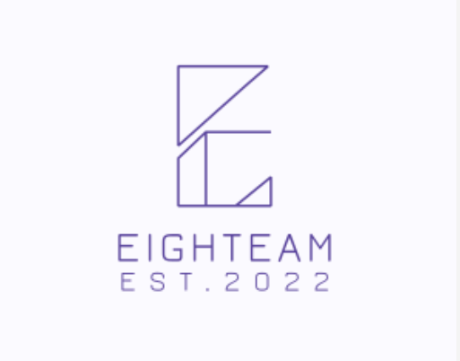

# Team Eighteam and Logo/Theme

# Team Values
- Respect each other
- Transparency
- Be responsible
- Write quality code

# Team Roster

**Name:** Mandeep Chera

**Overview:** I am a 4th year Computer Science major who has a keen interest in machine learning, computer vision, artificial intelligence, and software development. I am proficient in the programming languages of Python, C++, and Java, as most of my projects were made through these. I am also sufficiently familiar with the languages of JavaScript, HTML, and CSS. In respect to my work ethic, I try my best to complete my work thoroughly, effectively, and efficiently. I am taking CSE 110 in an effort to learn and master software engineering practices to one day apply to my future career.

**[Github Page](https://github.com/mchera24)**

##

**Name:** Ira Hanabusa

**Overview:** Hello! I am a 3rd year Computer Engineering major at ERC. I enjoy the outdoors and playing videogames both solo and with friends. I have primarily used Java, C, and C++ up to this point. I don't have much webdev experience besides making a simple website in highschool, but I hope to get used all sorts of tools throughout this course.

**[Github Page](https://github.com/ihanabus)**

##

**Name:** Yiyu Weng

**Overview:** 👋Hi! I am a 3rd year Math-cs major and Psychology minor student.👀I am interested in machine learning, ios app development, and web development. 🌱 I am currently learning more about front end, HTML, CSS, and JavaScript. 🍳 I enjoy cooking. I spend my free time with my friends and cats!
This is my first time to work with a big team, I hope I can gain more experience about team work!

**[Github Page](https://github.com/yyWeng)**

##

**Name:** Nathan Karter

**Overview:** What's up? I'm a 3rd year Math-CS major. I honestly have no idea yet what I'm interested but that's why I'm taking a bunch of different courses at school. I want to learn how to properly create software in a team environment, which makes me really excited for this project. Overall, I'm not too experienced with this however, so this might be quite the challenge. Outside of school, I like watching baseball and playing Smash Bros.

**[Github Page](https://github.com/nkarter02)**

##

**Name:** Jiayi Guan

**Overview:** Hi, I'm a 4th year Math-CS major student. I'm interested in game development but don't know much about it yet. The programming languages I use are C++, JAVA, C, not so familiar with Python. Currently taking an online web dev bootcamp, but moving slow and still lack experience. I love Kpop, Jpop, and Jrock, also video games, mostly RPG.

**[Github Page](https://github.com/JiayiGuan99)**

##

**Name:** Hariz Megat Zariman

**Overview:** Hey there! I'm a 3rd year Computer Engineering major and am pretty intereseted in machine learning, web development and software engineering! I'm really looking forward to working in a large team environment. I feel comfortable programming in Python, Java, C/C++ as well as some frameworks like Flask/Django and Node.js! In my free time I like playing golf/fencing and binge-watching tv shows :)

**[Github Page](https://github.com/hzariman)**

##

**Name:** Yi Yao

**Overview:** Hiiiiii! Here is a senior ECE student at UCSD. This is my second year at UCSD. I am working on Deep learning, Algorithm, and this class also. I have experiment with C++, Java, Python, R, HTML, CSS, Java script and so on. However, I never used any react or vue framework. Feel free text me and I will be answer quick! This is my first time work project with that much people. Happy to work with you all! 

**[Github Page](https://github.com/yiy054)**

##

**Name:** Danny Quang

**Overview:** Hello, I am a 3rd year Computer Science major. I am currently still exploring the many fields that make up computer science! So far I have actually been enjoying CSS despite the length of the labs (coincidentally I finessed my way into being webmaster for AIAA, so I have to learn how to maintain websites soon anyways). I like playing waterpolo and swimming, go-karting, anime, trying new restaurants, new sports, learning new aspects about other cultures, gaining new insights/opinions, etc. I look forward to working with y'all!

**[Github Page](https://github.com/dquangucsd)**

##

**Name:**

**Overview:**

**[Github Page]()**

##

**Name:**

**Overview:**

**[Github Page]()**

